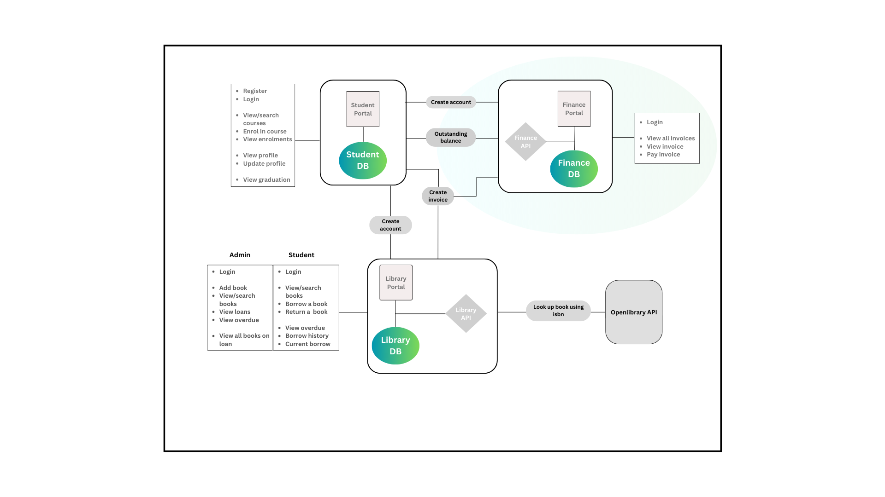

# Finance Portal
A microservices-based web application for a university's finance portal.
The application is written in Node.js using the express framework.

## Finance portal Features
1. Create Account - Create a finance account by passing in the same details when creating student account.
2. Login - secure password-verified login.
3. Invoices - return all invoices for logged in user.
4. Find Invoice - return a single invoice based on unique reference.
5. Pay Invoice - pay an unpaid invoice.

### Tools - tools to be installed and setup
    1. Postgres - (https://www.postgresql.org/download/)
    1. PGADMIN - (https://www.pgadmin.org/download/)
    2. Node version 16 - (https://nodejs.org/en/download)

### Integrations
### 1. Database
    The application integrates with a postgres database,
    Run the following commands in the terminal: to create the finance database and models:
        `npx sequelize db:create` or `sequelize db:create`
        `npx sequelize db:migrate` or `sequelize db:migrate`

### 2. Student
    * The application integrates with the [Student microservice](https://github.com/winiesom/sesc-student-portal) via REST.
    * When a student is created in the Student microservice, a request is sent to this application to create an account for the student.
    * The credentials to login are the same credentials used in the student portal (c77777777, password).
    * When a student enrols in a course, a request is sent to this application to generate an invoice.
    * When a student checks their eligibility to graduate, a request is sent to this application to see if outstanding is true or false.

### 3. Library
    * The application integrates with the [Library microservice](https://github.com/winiesom/sesc-library-portal) via REST.
    * When a borrowed book is overdue and is returned late, a request is sent to this application to generate an invoice.

## Demos

## Running the application
    1. Ensure the Student and Library portals are running.
    2. Rename the `.env.example` file in the server root directory to `.env`
    3. Edit the credential in the `.env` file and add you secret key (JWT_SECRET = 123456)
    4. In the server root, rename the `configExample` folder and `config.json.example` file as follows:
        `config` and `config.json`
    5. Edit the `config.json` file as follows: for development, test and production add the (username, password, database). Note: you may need to download PGADMIN desktop version.
    6. From the server directory, run the following commands in seperate terminals:
        `npm install`
        `npm start`
        `npm run test`

